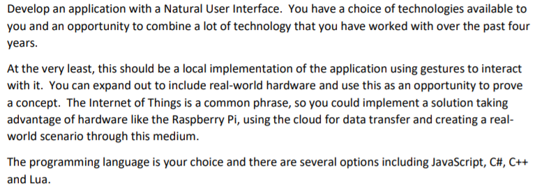

# Gesture Based UI Development Project

><b>Course:</b> BSc (hons) in Software Development, Year 4     
><b>Module:</b> Gesture Based UI Development  
><b>Students:</b> Patrick Moran g00179039 Gerard Naughton g00209309
><b>Lecturer:</b> Damien Costello 

## [Contents](#contents)
* [Introduction](#intro)
* [Purpose of the application](#purpose)
* [Gestures identified as appropriate for this application](#gestures) 
* [Architecture for the solution](#arc)
* [Conclusions & Recommendations](#conclusion)
* [References](#references)

# Introduction
This repository contains a solution to our Fourth Year, Gesture Based UI and Development Project.

### Project Spec

[Top](#contents) 

# Purpose of the application

[Top](#contents) 

# [Gestures identified as appropriate for this application

[Top](#contents) 

# Architecture for the solution

[Top](#contents) 

# Conclusions & Recommendations

[Top](#contents) 

# References

[Top](#contents) 

