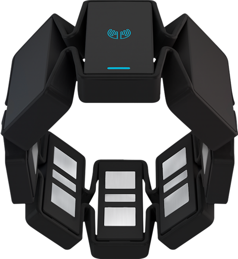
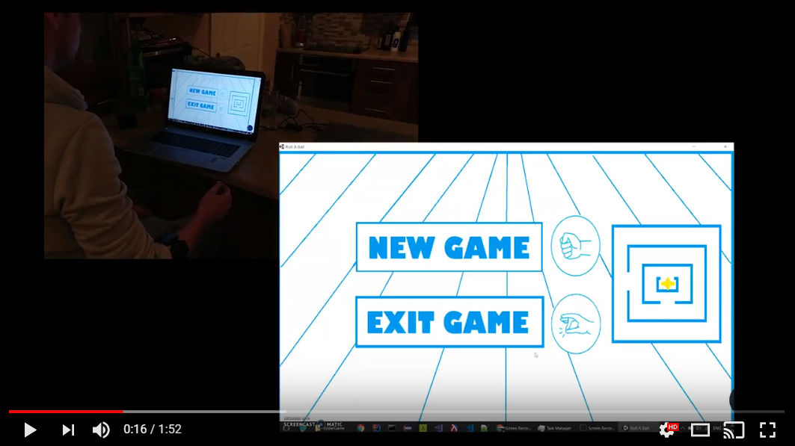

# Gesture Based UI Development Project

><b>Course:</b> BSc (hons) in Software Development, Year 4     
><b>Module:</b> Gesture Based UI Development  
><b>Students:</b> Patrick Moran g00179039 Gerard Naughton g00209309  
><b>Lecturer:</b> Damien Costello 

## [Contents](#contents)
* [Introduction](#intro)
* [Purpose of the application](#purpose)
* [Video Demo](#demo)
* [Gestures identified as appropriate for this application](#gestures) 
* [Architecture for the solution](#arc)
* [How To Run](#run)  
* [Conclusions & Recommendations](#conclusion)
* [References](#references)

# Introduction
This repository contains a solution to our Fourth Year, Gesture Based UI and Development Project.

### Project Spec

For our project we have decided to use a [Myo Armband](https://www.myo.com/) along with [Unity](https://unity3d.com/) to develop a simple 3d, ball and maze game.

### Myo Armband

The Myo armband, manufactured by [Thalmic Labs](https://www.thalmic.com/), is a wearable gesture control and motion control device that lets you take control of your phone, computer, and so much more, touch-free. It allows the user to wirelessly control control these devices using various hand motion and gestures.

### Unity
 

Unity is a cross-platform game engine developed by [Unity Technologies](https://unity3d.com/), which is primarily used to develop both three-dimensional and two-dimensional video games and simulations for computers, consoles,and mobile devices.

[Top](#contents) 

# Purpose of the application

For our application we decided to build a unity game using a Myo Armband as its controller. This would be our first attempt building a unity game and thought it would be a good addition to our github portfolio and our resume.

The main purpose of the application (linking up a unity game with a Myo Armaband) is the fun aspect myo brings to it. You could easily control the game with a keyboard or even a mouse but using your own physical body to control your game control brought a real kick to the game.

Taking on two new technologies is always tough so we kept the game concept simple. We created a Roller ball game. The user would navigate through a maze and collect tokens until all 12 tokens were collected. 

Myo implementation was achieved by using the gyroscope within the myo armband to control the direction/movement of the ball object. The menu options were also controlled my the Myo Armband. We used the built in gestures to control Game stage control. eg Menu -> New Game or exit would be chosen using the default gestures.     

[Top](#contents) 

# Video Demo
<kbd></kbd>

[Top](#contents)

# Gestures identified as appropriate for this application

As explained above we created a Roller Ball game.

We used the default gestures the Myo Armband offers. These are:

* Wave Left

* Wave Right

* Fist

* Double Tap

* Fingers Spread

After downloading the Myo connect and using its set-up program, we got to test each of these gestures. Being able to tighten and loosen the armband around your arm allowed for more accurate results. After playing around with each gesture we eventually decided what gestures would suit our application the best. 

In our Menu scene the user is offered 2 options:

1. New Game 
    Here we use the fist gesture as it works well and feels intuitive.
2. Exit
    Here we use the double-tap gesture. This requires double the action and speed, so it made sense to use as it would be hard to do by accident. This will close the application.

As the game is being run the user can use one gesture:

1. Double-tap
    If you double-tap as the game is being played you will bring up the pause Menu. This was chosen again because this gesture requires double the action and speed, so it made sense to use as it would be hard to do by accident and very annoying mid-game if you kept pausing.

In our Pause Menu the user has 3 options:

1. New Game
    Here we use the fist gesture as it works well and feels intuitive.
2. Resume Game
    Here we used the Spread-fingers gesture as it works well and feels like your dismissing your pause menu with your hand gesture.
3. Exit Game
    Here we use the double-tap gesture again. This requires double the action and speed, so it made sense to use as it would be hard to do by  accident. This will bring you back to the main menu.

For our ball controller we used the gyroscope within our myo to control its direction.

* Forward motion:
Achieve this by holding your fore arm at a 80-90 degree angle to your body or lower. 

* Backward motion:
Achieve this by moving your fore arm up towards your chest. 

* Right motion:
Move your fore arm to the right in a rotation from your elbow.

* Left motion:
Move your fore arm to the left in a rotation from your elbow.

We found this setup very effective. Only having trouble with configuring the gyroscope rotation to give more consistent figures.

[Top](#contents) 

# Architecture for the solution

* The Architecture of our project is made up of:  
    * A Myo Armband
    * Unity 5 working with C# Scripts 

Overview Of Our Architecture:

We Have The Following C# Scripts:  
* Player Controller
    * This script handles the player controller movement, counting objects collided with and displaying game result.
* Camera Controller
    * This script manages the camera movement, following the player.
* Rotator
    * This script is used to rotate the collectable pick up objects
* Menu
    * This script handles the menu scene when you start the game.

[Top](#contents) 

# How To Run
In order to run this project you will need:  
1. A [Myo Armband](https://www.myo.com/).
2. Then download the rollerGame.exe from our repo [here](). 
3. Play!

Or you can run our application in developer mode with the following prerequisites installed.
* [Unity 5](https://unity3d.com/get-unity/download).
* Clone this repo, open as a unity project, then from the file menu select build settings.
    * Select you platform and then select build and run.

[Top](#contents) 

# Conclusions & Recommendations

### Overall Outcome

All in all we were happy with our finished project. We set out our objectives which were to create a unity game and implement a Myo Armband as its controller. We created an application with a easy to follow natural UI, A game that functions with our Myo gestures and all in all is quite enjoyable. 

As it was our first time using these technologies it was a challenge and took time. Would of prefferred to have offered more game play options but thought it was more important to focus on a complete working implementation of our Myo/Unity Game. 

### Issues
We struggled at first getting our heads around unity but with tutorials we quickly learned. We also ran into some issues with unity IDE and also connecting to the Myo. Debugging and testing was tedious as Unity IDE kept freezing and would have to restart. We looked up Unity forums but it just seemed to be a common problem known in the unity community and we could not find a fix.

This was also common with our Myo aswell. As for Myo there wasnt that much documentation on Myo and unity so we just worked with what we had and got through it. Hopefully in future these will be fixed.

### What we learned

We learned how powerful unity can be. For a free game developer platform edition it offers alot to a developer. We learned new concepts related to gaming. As for Myo we were quite surprised how well the gestures performed. The applications are endless and with the custom profile options you can develope your own gestures which are unique to you only. 

[Top](#contents) 

# References
https://docs.unity3d.com/Manual/index.html  
https://unity3d.com/learn/tutorials/s/roll-ball-tutorial  
https://en.wikipedia.org/wiki/Unity_(game_engine)  

[Top](#contents) 

